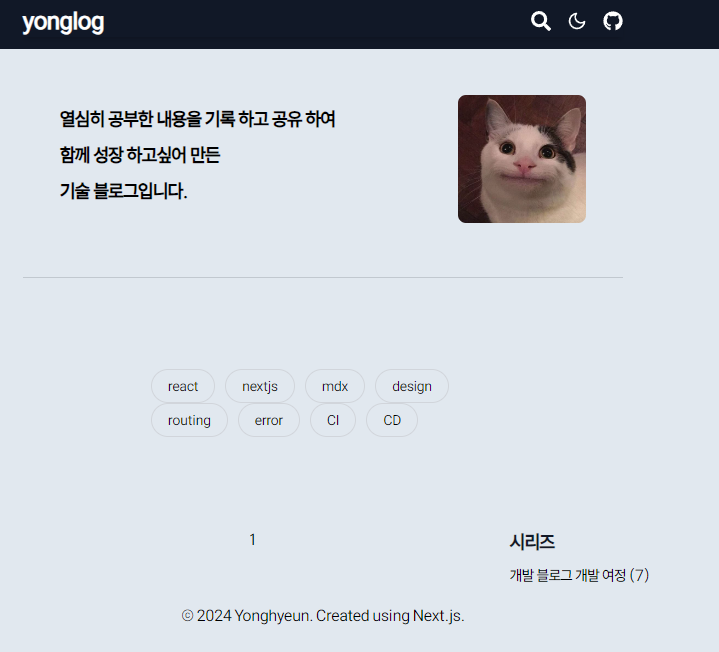
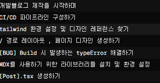
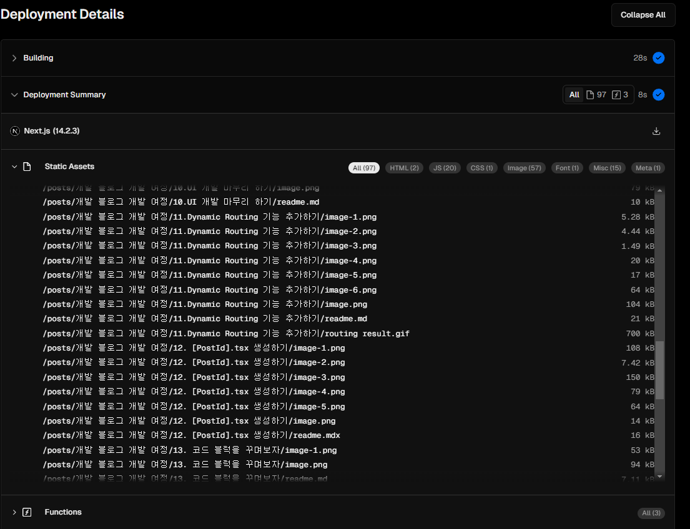

# 문제 정의

```tsx
import CategoryList from '@/components/Category';
import SideBar from '@/components/Sidebar';
import Introduce from '@/components/Introduce';
import Pagination from '@/components/Pagination';
import { PostList } from '@/components/PostList';

import type { SearchParams } from '@/types/global.d.ts';

const Page = ({ searchParams }: { searchParams: SearchParams }) => {
  /* 서버 컴포넌트의 props.searchParams 는 Object 객체이다.
  컴포넌트나 메소드 내에서 URLSearchParams 를 이용하기 때문에 복사본 생성
  */
  const _searchParams = new URLSearchParams(searchParams);

  return (
    <section className='mx-0 sm:mx-auto w-full lg:w-1/2'>
      <div className='hidden md:block'>
        <Introduce />
      </div>
      <CategoryList />
      <section className='w-full lg:w-[120%] flex gap-5'>
        <section className=' bg-black-200 w-full lg:w-8/12 px-4'>
          <PostList searchParams={_searchParams} />
          <Pagination searchParams={_searchParams} />
        </section>
        <div className='hidden lg:block lg:flex-2 sticky top-0 w-4/12'>
          <SideBar />
        </div>
      </section>
    </section>
  );
};

export default Page;
```



현재 배포 시 `/` 경로에 존재하는 `page.tsx` 에서 `PostList` 컴포넌트 부분이 서버에서 렌더링 되지 않는다.

`dev` 모드에선 문제 없이 `PostList` 부분이 렌더링이 잘 됨에도 불구하고 왜그럴까 ?

### `components/PostList.tsx`

---

```tsx
import Link from 'next/link';
import Image from 'next/image';
import { selectPosts } from '@/app/lib/post';
import type { PostInfo } from '@/types/post';

export const PostList = ({
  searchParams,
}: {
  searchParams: URLSearchParams;
}) => {
  const page = searchParams.get('page') || '1';
  const postList = selectPosts(searchParams);

  const POSTS_PER_PAGES = Number(process.env.POSTS_PER_PAGES);
  const offSet = Math.max(0, (Number(page) - 1) * POSTS_PER_PAGES);

  const slicedPostList = postList.slice(offSet, offSet + POSTS_PER_PAGES);

  /* 디버깅을 위해 로깅했던 것 
  console.log(searchParams.toString());
  postList.forEach((post) => console.log(post.meta.title));
  console.log(POSTS_PER_PAGES);
  console.log(slicedPostList.length);
  */

  return slicedPostList.map(({ meta }, id) => (
    <PostItem meta={meta} key={id} />
  ));
};
```

그래서 `public/posts` 폴더에 있는 `post` 들을 가져오는데 있어 문제가 있는건가 싶어 `PostList` 가 렌더링 될 떄 디버깅을 위해 로그를 찍도록 하였다.

이렇게 로깅하고 나니 문제가 두 개로 명확해졌다.

## 1. `public/posts` 에서 `.mdx` 파일 확장자만 가지고 오고 있더라

해당 부분은 로깅을 하다 보니 알게 된 사실이였는데 이게 더 심각한 문제였다.

현재 나는 몇 가지 실험을 하느라 포스팅 게시글의 확장자를 `md , mdx` 파일 두 가지 종류로 설정해뒀었다.

이 때 `selectPosts` 로 가져오는 포스팅들을 보면 현재 14개의 게시글 중 단 7개의 게시글만 가져와서 의아했었다.



알고 보니 현재 `mdx` 확장자들만 가지고 오고 있었다.

## 2. `process.env` 파일이 인식이 되지 않아 가져온 `postList` 들을 0개의 배열로 `slice` 하고 있었다.


사실 1번 문제는 포스팅들을 전체 가져오지 못하고 일부만 가져오는 것이기 때문에 페이지에 렌더링이 되지 않는 것과는 독립적인 문제이다.

실제로 가져온 포스팅들에 대해선 `/[postId]` 로 라우팅 하면 해당 게시글로 잘 라우팅 되어 게시글도 잘 보이더라

다만 문제는 가져왔다면 왜 렌더링이 되지 않는가 ? 에 대한 문제였는데 알고보니

```tsx
// POSTS_PER_PAES 는 개발 시엔 10개이지만 , 배포시엔 undefined => 0 으로 인식
const POSTS_PER_PAGES = Number(process.env.POSTS_PER_PAGES);
const offSet = Math.max(0, (Number(page) - 1) * POSTS_PER_PAGES);

const slicedPostList = postList.slice(offSet, offSet + POSTS_PER_PAGES);
slicedPostList.forEach((post) => console.log(post.meta.title));
```

이 부분에서 `process.env` 가 개발 시엔 `.env.loacl` 파일을 잘 읽어와 10개씩 포스트를 슬라이스 했다면

배포 시에는 `process.env` 의 값을 가져오지 못해 가져온 7개의 `mdx` 파일들을 0개의 배열로 슬라이스 하고 있었다.

문제를 하나씩 해결해나가보자

# `getAllPosts` 에서 `mdx` 파일만 가져오는 문제를 해결해보자

---

첫 번쨰 문제인 `mdx` 파일 확장자로 이뤄진 포스팅들만 가져오는 문제를 해결해보자

문제가 되었던 `selectPosts` 메소드 내부를 살펴보면 여러 메소드들의 조합으로 이뤄져있다.

### `selectPosts`

```tsx
/**
 * SearchParms 에 맞게 적절한 PostList 를 반환하는 메소드
 */
export const selectPosts = (searchParams: URLSearchParams): Array<PostInfo> => {
  const allPosts = getAllPosts();
  const tag = searchParams.get('tag');
  const series = searchParams.get('series');

  if (!tag && !series) {
    return allPosts;
  }
  return allPosts.filter((post) => {
    const { meta } = post;
    return (
      (!tag || isPostHasTag(meta.tag, tag)) &&
      (!series || meta.series === series)
    );
  });
};
```

결국엔 `getAllPosts` 메소드를 호출 한 후 필터링 하는 것이다. 그렇다면 `getAllPosts` 를 살펴보자

### `getAllPosts`

```tsx
export const getAllPosts = (): Array<PostInfo> => {
  const POST_PATH = path.join(process.cwd(), 'public/posts');
  const posts = parsePosts(POST_PATH);

  return posts.toSorted((prev, cur) => {
    const prevTime = prev.meta.time;
    const curTime = cur.meta.time;

    return curTime - prevTime;
  });
};
```

`getAllPosts` 는 포스트들이 존재하는 경로를 이용해 `parsePosts` 로 포스팅 된 게시글들을 가져온다.

### `parsePosts`

```tsx
const parsePosts = (source: Source): Array<PostInfo> => {
  const Posts: Array<PostInfo> = [];

  const parseRecursively = (source: Source): void => {
    getAllPath(source).forEach((fileSource: Source) => {
      if (isDirectory(fileSource)) {
        parseRecursively(fileSource);
      } else {
        if (isMDX(fileSource)) {
          const fileContent = fs.readFileSync(fileSource, 'utf8');
          const { data, content } = matter(fileContent);

          /* data.postId 가 존재하지 않으면 PostID 를 생성한 후 Post 저장*/
          if (!data.postId) {
            data.postId = Math.ceil(Math.random() * 9 * 100000);
            const updatedContent = matter.stringify(content, data);
            fs.writeFileSync(fileSource, updatedContent, 'utf-8');
          }
          /* data.date , time 이 존재하지 않으면 build 타임 기준으로 하여 생성 */
          if (!data.date) {
            data.date = new Date().toDateString();
            data.time = new Date().getTime();
            const updatedContent = matter.stringify(content, data);
            fs.writeFileSync(fileSource, updatedContent, 'utf-8');
          }

          /* 추후 이미지 파일에 접근하기 위해 해당 포스트가 존재하는 폴더 명을 meta 데이터에 저장 */
          const directoryPath = path.join(fileSource, '..');
          const relatevePath = directoryPath.split('public')[1];

          Posts.push({
            meta: {
              ...data,
              series: getSeriesName(fileSource),
              seriesThumbnail: getValidThumbnail(fileSource),
              path: relatevePath,
            },
            content: content,
          });
        }
      }
    });
  };

  parseRecursively(source);

  return Posts;
};
```

`parsePosts` 매소드는 제귀적으로 `file system` 에 접근하여 `isMDX` 조건을 만족하는 파일들을 가져온다.

### `isMDX`

```tsx
/**
 * source 에 존재하는 file이 mdx 파일인지 확인하는 메소드
 * 이 때 반환값에 타입 가드를 설정해주도록 한다.
 */
const isMDX = (source: Source): source is MDXSource => {
  const fileName = path.basename(source);
  return path.extname(fileName) === '.mdx' || path.extname(fileName) == '.md';
};
```

`isMDX` 는 파일 확장자명이 `.mdx | .md` 이면 `true` 값을 반환한다.

그럼 발생 할 수 있는 몇 가지 가능성을 생각해보도록 하자

## 혹시 배포 시 `.md` 파일들은 배포가 안되었나 ?



그렇지 않다. `vercel` 을 살펴보면 `md` 확장자 , `md` 확장자 가릴 것 없이 잘 배포 되고 있는 모습을 볼 수 있다.

디버깅 할 포인트들을 `parsePosts` 내부를 통해 살펴보자

```tsx
const parsePosts = (source: Source): Array<PostInfo> => {
  const Posts: Array<PostInfo> = [];

  const parseRecursively = (source: Source): void => {
    getAllPath(source).forEach((fileSource: Source) => {
      if (isDirectory(fileSource)) {
        parseRecursively(fileSource);
      } else {
        if (isMDX(fileSource)) {
          /* 이 곳에 확장자명이 md , mdx 인 파일이 모두 잘 들어왔는지 확인 */
          const fileContent = fs.readFileSync(fileSource, 'utf8');
          const { data, content } = matter(fileContent);
          /* 나머지 코드 생략 */
          Posts.push({
            meta: {
              ...data,
              series: getSeriesName(fileSource),
              seriesThumbnail: getValidThumbnail(fileSource),
              path: relatevePath,
            },
            content: content,
          });
        }
      }
    });
  };

  parseRecursively(source);

  return Posts;
};
```

이 두 단계를 디버깅 포인트로 잡고 로깅을 다시 해보자

```tsx
  if (isMDX(fileSource)) {
          console.log('---isMDX 외부---');
          console.log(path.join(fileSource));
          console.log('----');
          const fileContent = fs.readFileSync(fileSource, 'utf8');
          const { data, content } = matter(fileContent);
```

```tsx
/**
 * source 에 존재하는 file이 mdx 파일인지 확인하는 메소드
 * 이 때 반환값에 타입 가드를 설정해주도록 한다.
 */
const isMDX = (source: Source): source is MDXSource => {
  console.log('---isMDX 내부---');
  console.log(path.join(source));
  console.log('----');

  const fileName = path.basename(source);
  return path.extname(fileName) === '.mdx' || path.extname(fileName) == '.md';
};
```

두 포인트에 로깅을 잡고 배포를 다시 해보자
