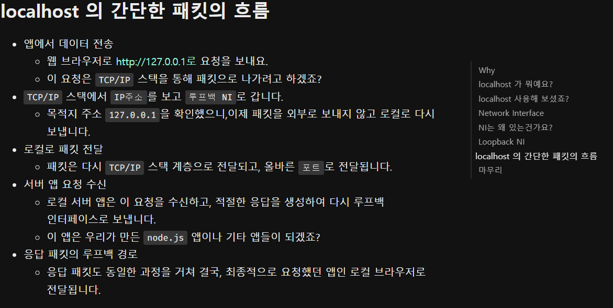

`Velog` 의 사이드바처럼 인터렉티브하게 사용자가 보고 있는 영역에 맞춰 활성화 되고

클릭하면 해당 타이틀로 이동하는 사이드바를 만들어보자

# 사이드바 프로토타입 만들기

```tsx title="app/[postId]/page.tsx" showLineNumbers{17} {10}#remove {11-12,32-46}#add
const PostPage = ({ params }: { params: { postId: string } }) => {
  const { meta, content } = getPostContent(params.postId);
  const components = useMDXComponents({}, meta.path);

  return (
    <>
      <header className='pt-14 mb-12'>
        <PostTitle meta={meta} />
      </header>
      <main className='px-14'>
      <main className='w-[100%] lg:w-[150%] flex'>
        <section className='px-7 w-[100%] lg:px-14 lg:w-[70%] lg:mr-[2rem]'>
          <Suspense fallback={<LoadingContnet />}>
            <MDXRemote
              source={content}
              components={components}
              options={{
                mdxOptions: {
                  remarkPlugins: [remarkGfm],
                  rehypePlugins: [
                    [
                      rehypePrettyCode,
                      {
                        theme: 'material-theme-darker',
                      },
                    ],
                  ],
                },
              }}
            />
          </Suspense>
        </section>
        <section className='hidden lg:block'>
          <nav className='sticky top-[15rem] w-[250px]  border-l-[2px] pl-3'>
            <ul>
              <li>
                Lorem ipsum dolor sit amet consectetur, adipisicing elit. Illum
                ullam odio quo nobis blanditiis dicta corrupti id ex quis nisi,
              </li>
              <li>
                Lorem ipsum dolor sit amet, consectetur adipisicing elit. Saepe
              </li>
            </ul>
          </nav>
        </section>
      </main>
    </>
  );
};

export default PostPage;
```

# 라우팅은 어떻게 할까?

라우팅 자체는 그닥 어려운 문제가 아니다.

```tsx title="app/[postId]/page.tsx" showLineNumbers{17} {33}
const PostPage = ({ params }: { params: { postId: string } }) => {
  const { meta, content } = getPostContent(params.postId);
  const components = useMDXComponents({}, meta.path);

  return (
    <>
      <header className='pt-14 mb-12'>
        <PostTitle meta={meta} />
      </header>
      <main className='px-14'>
        <Suspense fallback={<LoadingContnet />}>
          <MDXRemote
            source={content}
            components={components}
            options={{
              mdxOptions: {
                remarkPlugins: [remarkGfm],
                rehypePlugins: [
                  [
                    rehypePrettyCode,
                    {
                      theme: 'material-theme-darker',
                    },
                  ],
                ],
              },
            }}
          />
        </Suspense>
      </main>
    </>
  );
};

export default PostPage;
```

MDX 파일을 변환 할 때 `remarkPlugins` 에 `remarkGfm` 을 이용해주고 있는데 해당 플러그인을 사용하면 자동으로 `h1~h6` 까지의 `children` 을 `id` 로 적용시켜놔준다.
