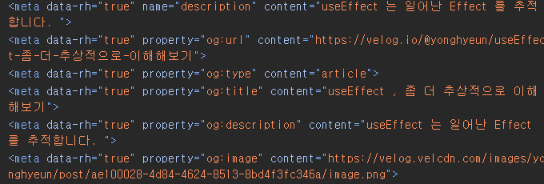

[기술 블로그의 SEO를 최적화 하기 위한 방법 Part1](https://yonglog.vercel.app/post/493728) 이전 포스트에서 SEO의 개념에 대해 알아보고 URL 구조 경로를 수정하거나 `title` 태그를 추가해줬다.

이번 파트에서는 `SEO` 와 큰 관련이 있는 `meta` 태그들을 활용하여 `SEO` 를 최적화 해보도록 하자

# meta 태그가 무엇일까 ?

`meta` 태그는 웹 페이지에 대한 정보를 제공하는 태그이다.

직접적으로 페이지에 렌더링 되는 정보는 아니지만 브라우저나 검색엔진 , 웹 서비스 등에게 페이지의 정보를 제공 할 수 있다.

기본적으로 `html` 파일을 만들면 `head` 태그 내에 기본 설정된 `meta` 태그 등이 존재하는 모습을 심심찮게 볼 수 있었을 것이다.

```html title="기본 html 생성 시 생성되는 meta 태그들의 모습" {4-5}
<!DOCTYPE html>
<html lang="en">
  <head>
    <meta charset="UTF-8" />
    <meta name="viewport" content="width=device-width, initial-scale=1.0" />
    <title>Document</title>
  </head>
  ...
</html>
```

이전 챕터에서 말했듯 페이지가 검색 엔진에서 나타나기 위해선 검색 엔진이 페이지를 올바르게 평가하고 높은 순위를 매겨야 검색 엔진에서 상단에 노출된다.

검색 엔진에게 페이지에 대한 적절한 정보를 `meta` 태그에 담아 생성해야 검색 엔진에게 높은 평가를 받을 수 있다.

# meta 태그의 종류

크게 나눠봤을 때 `meta` 태그는 두 가지 종류로 나눌 수 있다.


직접적으로 페이지의 정보를 담는 `Description meta tag` 와 검색 엔진의 크롤러 로봇이 확인 할 수 있는 `Robots meta tag` 이다.

> `title element` 는 `meta` 태그가 아니지만 종종 `meta` 태그의 일부분으로 분류되곤 한다고 한다.

# meta 태그를 사용하기 위해 알아야 하는 선수 지식들

## meta 태그는 head 태그 내부에 존재해야 한다.

`html` 문서의 의미론적 구조에로 보았을 때 페이지의 본문과 관련된 내용은 `body` 태그 내부에 담아 사용 하는 것이 일반적이다.

`meta` 태그는 페이지의 본문과 관련된 내용이 아니기에 `head` 태그에 담아 선언해주도록 하자

## meta 태그는 lifting up 되기도 하고 상속 되기도 한다.

검색 엔진의 크롤러는 페이지의 `html` 문서를 전부 확인 할 때 상단부터 하단까지 전체적으로 훑으며 `meta` 태그들을 수집해나간다.

예를 들어 다음과 같은 문서 구조가 있다고 해보자

```html title="meta 태그가 사용된 문서의 예시 , title은 liftngup , autor 는 상속" {6-7,14}
<!DOCTYPE html>
<html lang="en">
  <head>
    <meta charset="UTF-8" />
    <meta name="viewport" content="width=device-width, initial-scale=1.0" />
    <meta description="저의 문서입니다" />
    <meta author="김땡땡" />
    <title>Document</title>
  </head>
  <body>
    {/* body 태그 내부 정보는 라우팅 경로에 따라 다르다고 가정해보자 */}
    <section>
      <head>
        <meta description="저의 자기소개와 관련된 문서입니다." />
      </head>
    </section>
  </body>
</html>
```

검색 엔진 크롤러는 문서 전체 구조를 살펴보며 `meta` 태그들을 수집한다.

이 때 `body` 태그 내부의 `meta` 태그들은 라우팅 경로에 따라 다르다고 가정해본다면

크롤러는 자기 소개와 관련된 경로인 `/introudce` 라는 페이지의 `meta` 태그를 정의 할 때 다음과 같이 정의한다.

- 상위 레이아웃인 `head` 에 존재하는 `charset , name , description , author` 를 통해 `meta` 태그를 정의한다.
- 문서를 훑으며 하위 레이아웃인 `body` 에 존재하는 `description` 을 통해 `meta` 태그를 정의한다.

이처럼 `author` 의 경우엔 하위 레이아웃에서 정의해주지 않았지만 상위 레이아웃에서 정의 한 `meta` 태그가 상속 되었다.

반대로 `title` 은 하위 레이아웃에서 재정의 되었기 때문에 상위 레이아웃에서 정의한 `title` 태그를 덮어 씌웠다.

이를 통해 경로에 따른 다른 레이아웃에서 `meta` 태그를 효과적으로 생성하는 것이 가능하다.

# meta 태그의 종류들을 알아보자

## meta.description

`meta` 태그의 `description` 은 문서의 전체적인 주제를 의미하는 태그이다.

검색 엔진은 문서의 전체적인 내용을 `title` 태그와 `meta.description` 에 정의 된 내용을 통해 문서의 전체적인 내용을 파악하고 검색 엔진에서 드러나게 한다.


예를 들어 파란 부분은 `title` 태그의 문서 , 회색 부분은 `description` 에 해당한다.

`description` 의 경우엔 주로 `50~160`자 사이의 길이를 사용하며 한글 기준으론 `80` 자 이내여야 한다고 한다.

너무 긴 경우엔 검색 결과에서 생략 되고 , 짧으면 충분한 정보를 제공 할 수 없다고 한다.

예전에는 별 생각 없이 `metadata` 부분을 썼었는데 검색 엔진에 띄워질 내용이라 생각하니 좀 더 성의있게 수정해주었다.

## meta.author

`meta.author` 태그는 문서의 저작권자에 대한 정보를 담고 있다.

## meta.keywords

`keywords` 는 페이지에서 다루는 키워드들을 `,` 로 구분한 문자열이다.

다만 구글 검색 엔진은 더 이상 `keywords` 를 검색 엔진 랭크를 선언 할 때 사용하지 않는다고 한다.

아무래도 무작위한 `keywords` 남발로 인해 적절하지 않은 문서들이 검색 브라우저에 뜨는 것을 방지하기 위함이 아닌가 싶다.

## openGraph

메타 태그의 `property` 인 `openGraph` 는 웹 문서가 소셜 미디어를 통해 공유될 때 사용되는 메타 태그이다.




예를 들어 디스코드에서 벨로그의 게시글을 공유하면 다음과 같이 `og: ..` 에 설정한 것과 같은 양상으로 나타나는 모습을 볼 수 있다.

## 파비콘


파비콘이란 인터넷 탭 옆에 존재하는 이미지 아이콘을 의미한다.

적절한 이미지를 가져와 `.ico` 확장자로 변경후 `public/asset/favicon.ico` 확장자로 생성해주었다.

# 루트 레이아웃 메타 태그 컴포넌트 생성하기

```tsx title="@/components/Meta.tsx" {1-31}#add
const layoutMeta = {
  name: 'abonglog',
  description:
    '프론트엔드 기술 블로그입니다. 열심히 공부한 내용을 기록하고 공유하여 함께 성장하고 싶습니다.',
  author: 'choiyonghyeun',
  keywords: 'front-end, react,nextjs,html,css',
  image:
    'https://abonglog.vercel.app/_next/image?url=%2Fasset%2Fprofile.jpg&w=256&q=75',
};

export const LayoutMeta = () => {
  return (
    <>
      <title>abonglog</title>
      {/* 파비콘들에 대한 링크태그 */}
      <link rel='icon' href='asset/favicon.ico' />
      {/* 공통 메타 태그 */}
      <meta name='description' content={layoutMeta.description} />
      <meta name='author' content={layoutMeta.author} />
      <meta name='keywords' content={layoutMeta.keywords} />
      {/* openGraph Meta 태그 */}
      <meta property='og:title' content={layoutMeta.name}></meta>
      <meta property='og:description' content={layoutMeta.description} />
      <meta property='og:image' content={layoutMeta.image} />
      <meta property='og:type' content='article' />
      <meta property='og:url' content='abonglog.me'></meta>
      {/* 트튀어 전용 Meta 태그*/}
      <meta name='twitter:title' content={layoutMeta.name} />
      <meta name='twitter:description' content={layoutMeta.description} />
      <meta name='twitter:image' content={layoutMeta.image} />
    </>
  );
};
```

```tsx title="/layout.tsx" {12}#add
...
import { LayoutMeta } from '@/components/Meta';
...
export default function RootLayout({
  children,
}: Readonly<{
  children: React.ReactNode;
}>) {
  return (
    <html lang='kr'>
      <head>
        <LayoutMeta />

```

이후 해당 태그를 `/` 에서 렌더링 되는 루트 레이아웃에서 추가해주도록 하자
