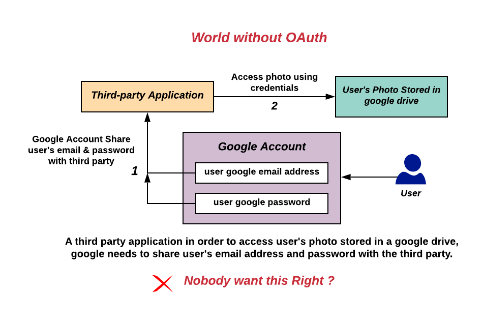

# 인증과 인가 (Authentication & Authorization)

인증과 인가는 특정 리소스에 접근하기 전 , **해당 리소스에 접근 할 권한이 있는지를 확인하고 , 부여하기 위해 필요한 프로세스이다.**

하나씩 알아가보자

## 인증 (Authentication)

인증은 사용자의 신원을 확인하는 프로세스이다.

인증 과정에선 다음과 같은 수집이 포함된다.

- 데이터베이스에 등록 된 아이디와 비밀번호를 통해 확인하는 방법

- **인증 서버에서 발급한 **토큰** 을 이용하여 인증하는 방법**

- 식별을 위해 디바이스에서 생체 인식 데이터를 확인 하는 방법

- MFA (Multi Factor Authentication) 과 같이 특정 인가 프로그램으로 전송되는 일회용 코드를 이용하는 방법

## 인가 (Authorization)

인가는 **인증이 된 사용자에게 특정 리소스에 접근하거나 특정 작업을 수행 할 수 있는 권한을 확인하는 프로세스이다.**

인가는 다음과 같은 종류들이 있다.

- 역할 기반 액세스 제어 : 사용자에게 역할을 할당하고 역할마다 가지고 있는 특정 권한을 부여함
- **속성 기반 액세스 제어 : 사용자 , 리소스 , 환경 요인 (시간 , 위치) 와 같은 속성을 기반으로 액세스를 부여함**
- 액세스 제어 목록 : 특정 리소스에 대한 액세스가 허용되는지 사용자 또는 그룹을 지정함

### 인증과 인가 정리

결국 인증과 인가는 리소스에 접근 하기 위해 사용자를 식별하고 , 식별된 사용자에게 리소스에 접근 할 수 있는 권한을 주는 행위이다.

이번에 알아볼 `OAuth` 는 토큰을 이용하여 인증하고 , 속성 기반으로 리소스에 대한 권한을 부여한다.

# OAuth 알아보기

## OAuth 를 이해하기 위한 용어 정리

우선 해당 개념을 공부 하기 전 용어를 명확히 하고 가자

- `Resoucre Owner` : 리소스 오너는 말 그대로 **어떤 리소스를 사용하고자 하는 주체**를 의미한다. 네트워크 엣지 부분에 존재하는 실 사용자이다.
- `Resource Server` : 리소스 서버는 리소스 오너가 사용하고자 하는 리소스들을 저장하고 있는 서버이다. 위 예시에선 구글 드라이브 서버에 해당한다. **리소스 서버에 저장된 리소스를 이용하기 위해선 권한이 필요하다.**
- `Authorzation Server` : 인증 서버는 리소스 서버의 리소스를 사용하기 인증과 인가 역할을 맡은 서버이다. 위 예시에선 구글 인증 서버에 해당한다.
- `Client` : 클라이언트는 **리소스 서버나 인증 서버에게로부터 리소스 오너에게 액세스 토큰을 발급 해 줄 권한을 인가를 미리 받은 주체**이며 리소스 오너가 사용 하고 있는 웹에 해당한다. 써드 파티 앱이라고도 한다.

## OAuth 는 왜 필요할까 ? : OAuth가 없을 떄를 가정해보자

만약 특정 서드 파티 앱에서 리소스 오너가 프로필 사진을 구글 드라이브에 있는 사진으로 업로드 하려고 한다고 해보자

그렇다면 다음과 같은 일들이 벌어져야 한다.

1. 리소스 오너가 구글 아이디와 비밀번호를 서드파티 앱에게 제공함
2. 서드파티 앱은 제공 받은 구글 아이디와 비밀번호를 이용해 리소스 서버에 직접 접근
3. 리소스 서버는 서드파티 앱을부터 받은 아이디와 비밀 번호를 통해 사진 제공

위 과정은 문제가 있다.

한 가지 문제로는 나의 구글 아이디와 비밀번호를 서드파티 앱에게 보내야 한다는 점이다.

민감한 리소스에 접근 할 수 있는 정보들이 리소스 서버나 인증 서버에게만 가는 것이 아니라 다른 서드 파티 앱에게 공유 하는 상황은 아무도 원하지 않는다.

이런 문제를 해결하기 위해 OAuth라는 개념이 등장했다.

OAuth는 클라이언트(서드파티 앱)가 **리소스 오너가 인증과 인가를 직접적으로 인증 서버로부터 받아올 수 있도록 인증 서버의 인증 URL로 리다이렉트 시켜 임시적인 인증과 인가를 받아오도록** 하고

임시적인 인증과 인가를 받은 리소스 오너를 클라이언트의 URL 로 코드 정보와 함께 리다이렉션 시킨다.

**클라이언트는 리소스 오너가 가지고 온 임시 코드를 이용해 인증 서버로부터 유효기간이 존재하는 토큰을 받아와 리소스를 사용 할 수 있도록 한다.**

전체적인 도식을 살펴보면 다음과 같다.

> 해당 도식화 이미지에서 인증 서버가 클라이언트에게 직접적으로 권한 부여 코드를 응답 하고 있는 모습으로 보인다.
>
> 이는 다양한 방법 중 하나로, 직접적으로 인증 서버가 클라이언트에게 임시 코드를 직접적으로 보낼 수도, 혹은 클라이언트가 인증 서버로부터 임시 코드를 발급 받은 후, 클라이언트의 URL로 리다이렉트 될 때 쿼리 파라미터에 임시 코드를 담아 접근 하기도 한다.
>
> 어떤 방법을 쓰든 결국 클라이언트에게 임시 코드를 보내는 행위는 동일하다.
>
> 도식에서 중요한 점은 임시 코드와 액세스 토큰에 대한 흐름과 리다이렉트를 통한 역할 분리이다.

# OAuth 2.0

2013년에 발표된 프로토콜 `OAuth 2.0` 은 2009년쯤에 발표된 `OAuth 1.0` 의 단점들을 보완하여 나온 프로토콜이다.

`OAuth 1.0` 에서도 리다이렉트를 이용한 인증 방식을 사용했지만 임시 코드가 존재하지 않아 액세스 토큰의 유효 기간이 매우 길었다는 점과 리소스 서버,인증 서버의 구분이 일어나있지 않았다는 차이점이 존재한다.

> [[NHN FORWARD 22] 로그인에 사용하는 OAuth : 과거, 현재 그리고 미래](https://www.youtube.com/watch?v=DQFv0AxTEgM&t=1613s)
> 전체적인 흐름은 해당 영상을 참고하면 좋을 것 같다. 정말 좋은 발표 영상이다.

# 출처

- [위키피디아 - OAuth](https://en.wikipedia.org/wiki/OAuth#/media/File:Without-oauth.png)
- [IT위키 - OAuth](https://itwiki.kr/w/OAuth#OAuth1.0%EA%B3%BC_OAuth2.0%EC%9D%98_%EC%B0%A8%EC%9D%B4)
